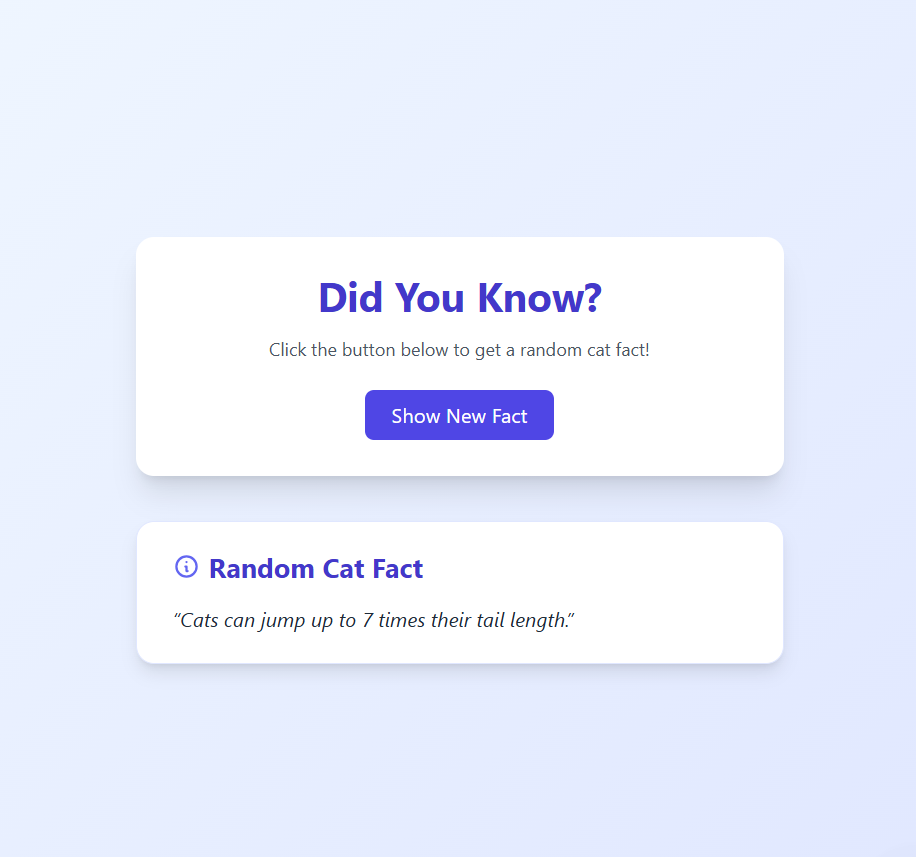

# 🐱 Cat Fact Fetcher

A simple and fun React app that fetches and displays random cat facts from a public API. Built using **React**, **Axios**, and **Tailwind CSS**. Great for learning API calls, async/await, and basic UI structuring.

---

## 🚀 Features

- 🐾 Fetches random cat facts using [catfact.ninja API](https://catfact.ninja/fact)
- 🔁 "Show Fact" button to fetch a new fact
- 🔄 Loading state while fetching data
- 🎨 Clean and responsive UI using Tailwind CSS

---
 
## 📸 Demo

  


---

## 🛠️ Tech Stack

- **React** (Functional components & Hooks)
- **Axios** (for API requests)
- **Tailwind CSS** (for styling)

---

## 📦 Installation & Running Locally

1. **Clone the repo**
   ```bash
   git clone https://github.com/frazhaidry/Assignment.git
   cd assignment
   ```

2. **Install dependencies**
   ```bash
   npm install
   ```

3. **Run the app**
   ```bash
   npm run dev
   ```

4. Visit [http://localhost:3000](http://localhost:3000) to view it in the browser.

---

## 📁 Project Structure

```
src/
├── components/
│   ├── Fact.jsx          # Main fact fetching component
│   └── Loading.jsx       # Loading spinner/message component
├── App.jsx
└── index.js
```

---

## 🙌 Acknowledgements

- [catfact.ninja](https://catfact.ninja/fact) for the free cat facts API

---


